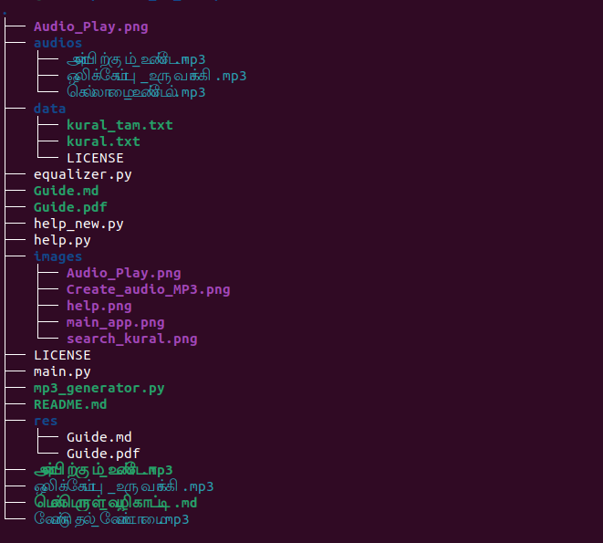

## ஒலி உருவாக்கி 

&nbsp;&nbsp;&nbsp;&nbsp;&nbsp;&nbsp;&nbsp;&nbsp;&nbsp;&nbsp;&nbsp;&nbsp;&nbsp;&nbsp;&nbsp;&nbsp;&nbsp;&nbsp;&nbsp;&nbsp;&nbsp;&nbsp;&nbsp;&nbsp;&nbsp;&nbsp;&nbsp;&nbsp;&nbsp;&nbsp;

மென்பொருள் வழிகாட்டி:

உங்கள் திருக்குறள் செயலியில் உள்ள "திருக்குறள் தேடு" அம்சத்தை பயனுள்ளதாகவும் எளிமையாகவும் பயன்படுத்துவதற்கான வழிகாட்டி இது. கீழே உள்ள படிநிலைகளைப் பின்பற்றுவதன் மூலம், நீங்கள் விரும்பிய குறள்களை எளிதில் தேடி கண்டுபிடிக்க முடியும்.

செயலியைத் தொடங்குக
நடைமுறை: Python3 main.py

திருக்குறள் தாவல்கள் அறிமுகம்
அறத்துப்பால் (அதிகாரம் 1-38)
பொருட்பால் (அதிகாரம் 39-108)
காமத்துப்பால் (அதிகாரம் 109-133)

இந்த தாவல்கள் மூலம், நீங்கள் விரும்பிய அதிகாரத்தைத் தேர்ந்தெடுக்கலாம்.

திருக்குறள் தேடல் அம்சத்தை அணுகுக
அறத்துப்பால், பொருட்பால், அல்லது காமத்துப்பால் தாவல்களில் எந்ததாவலிலும் நீங்கள் இருக்கலாம்.
மேல் பகுதியில் உள்ள தேடல் பட்டி (Search Bar) ஐ கவனிக்கவும்.

தேடல் முறைகளைப் புரிந்துகொள்ளவும்
குறள் எண் மூலம் தேடுதல்
எடுத்துக்காட்டு: "1" அல்லது "250"

தேடல் பட்டியில் உங்கள் விரும்பிய குறள் எண்ணை (எ.கா., 1) உள்ளிடவும்.
தேடு பொத்தானை அழுத்தவும்.
குறள் எண் பொருந்தும் குறள் உடனடியாக கீழே காணப்படும்.

அதிகாரம் பெயர் அல்லது சொல் மூலம் தேடுதல்

தேடல் பட்டியில் உங்கள் விரும்பிய சொல் அல்லது அதிகாரத்தின் பெயரை (எ.கா., "அறம்") உள்ளிடவும்.
தேடு பொத்தானை அழுத்தவும்.
பொருந்தும் அனைத்து குறள்களும் கீழே காணப்படும்.

தேடிவை கிடைக்காமை தொடர்பான செய்திகளைக் கவனிக்கவும்
குறள் எண் தவறானது:

குறள் எண் தவறாக உள்ளது. 1 முதல் 1330 வரை உள்ள எண்ணை உள்ளிடவும்.
இந்த செய்தி குறள் எண் சரியான வரம்புக்குள் இல்லாவிட்டால் காணப்படும்.

தேடுவதற்கான குறள் எண் அல்லது சொல் உள்ளிடவும்.
இந்த செய்தி தேடல் செய்யும் முன் உரை உள்ளிடப்படவில்லை என்றால் காணப்படும்.

ஒலி உருவாக்கி  கேட்கலாம்
ஒலிஉருவாக்கம்: தேடல் செய்த குறள்களைப் பயன்படுத்தி, அவற்றை ஒலியாக மாற்றி கேட்கலாம்.
பக்க பட்டியில் உள்ள  ஒலிஉருவாக்கி பொத்தானை கிளிக் செய்யவும்.
உரையை உள்ளிட்டு, ஒலியாக உருவாக்கி உரை ஓடுங்கள் பொத்தானை அழுத்தவும்.

குறளை வாசிக்கவும்
ஒலிக்கோப்பைத் திறக்கவும்  பொத்தானை அழுத்ததி உங்களுக்குத் தேவையாய ஒலிகோப்பை கேட்க்க மூடியும் அல்லது தேவையானால் பிரதி செய்யலாம்.

பயனர் இடைமுகம்: உங்களுக்கு விருப்பமுள்ள மாற்றங்களைச் செய்யலாம்.
தொழில்நுட்ப ஆதரவு:
செயலியைப் பயன்படுத்துவதில் ஏதேனும் சிக்கல்கள் அல்லது கேள்விகள் இருந்தால், கீழ்காணும் வழிகளால் உதவி பெறலாம்:
email: jesman23@gamil.com

## File Structure

The main folder 

├── audios
│   ├── அன்பிற்கும்_உண்டோ.mp3
│   ├── ஒலிக்கோப்பு_உருவாக்கி.mp3
│   └── செல்லாமை_உண்டேல்.mp3
├── data
│   ├── kural_tam.txt
│   ├── kural.txt
│   └── LICENSE
├── equalizer.py
├── Guide.md
├── Guide.pdf
├── help.py
├── images
│   ├── Create_audio_MP3.png
│   ├── help.png
│   ├── main_app.png
│   ├── Open_and_Play.png
│   └── search_kural.png
├── LICENSE
├── main.py
├── mp3_generator.py

├── README.md
├── res
│   ├── Guide.md
│   └── Guide.pdf
├── அன்பிற்கும்_உண்டோ.mp3
├── மென்பொருள்_வழிகாட்டி.md
└── வேண்டுதல்_வேண்டாமை.mp3

நீங்கள் மேலும் மாற்றங்களை விரும்பினால், தயவுசெய்து எனக்கு தெரியப்படுத்துங்கள்!

Author: Jesman Anthonypillai
மின்னஞ்சல்: jesman@gmail.com
